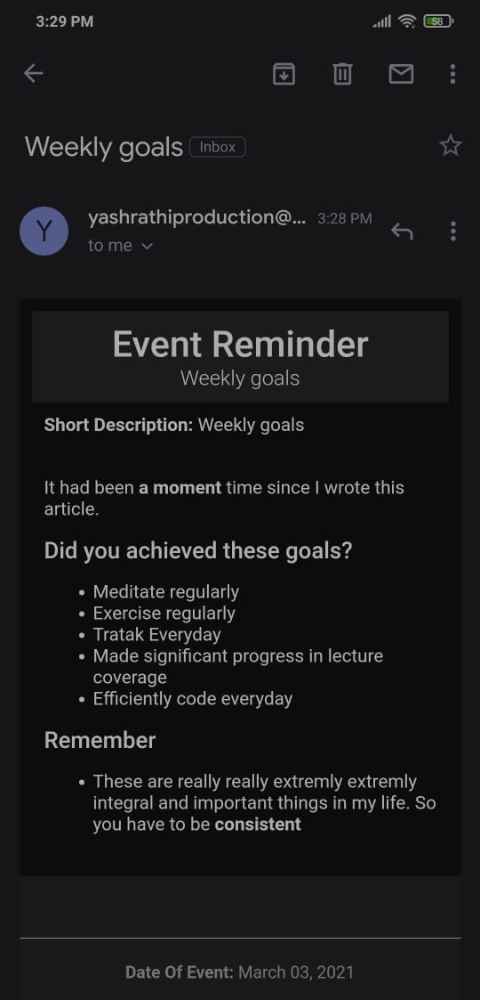

<p align="center">
  <a href="https://github.com/yashrathi-git/evem">
    
  </a>

  <h3 align="center">Evem</h3>

  <p align="center">
    A command line script for periodic reminders of events via email 
    <br />
    <br />
    <br />
  </p>
</p>

<!-- TABLE OF CONTENTS -->
<details open="open">
  <summary>Table of Contents</summary>
  <ol>
    <li>
      <a href="#about-the-project">About The Project</a>
    </li>
    <li>
      <a href="#getting-started">Getting Started</a>
      <ul>
        <li><a href="#installation">Installation</a></li>
      </ul>
    </li>
    <li><a href="#usage">Usage</a></li>
    <li><a href="#contributing">Contributing</a></li>
    <li><a href="#license">License</a></li>
  </ol>
</details>

<!-- ABOUT THE PROJECT -->

## About The Project
<p align="center">

</p>
You could create a new event (with markdown support for description) and set a reminder on a particular date or periodic reminder (like every 2 months, every year...). Evem will send emails on those dates with that information.

When it could be useful:

- It could be useful to periodically check in, on your progress on something
- For setting weekly and monthly goals and tracking progress.
- As reminder for certain events on **particular date or periodically**(like someone's birthday)

<!-- GETTING STARTED -->

## Getting Started

To set up the project follow these steps.

### Installation

1. Set environment variables:

   - EMAIL (of Gmail account)
   - PASSWORD

2. This gmail account email and password are used for sending email.
3. Clone the repo
   ```sh
   git clone https://github.com/yashrathi-git/evem
   ```
4. Navigate into the project directory
5. Install package
   ```sh
   pip install --editable .
   ```
6. Now `evem` will be accessible from anywhere, in file system.
7. Run this command to initialize it:
   ```sh
   evem init
   ```
8. For sending emails on particular date, it have to be run on startup. I think everyone starts their computer or laptop atleast once everyday. So when it starts Evem will check for if it needs to send any mail(reminders) and if yes send it in background and terminate.

9. Add the following command to run on startup:
   ```sh
   evem remind
   ```

<!-- USAGE EXAMPLES -->

## Usage

### Create new event

1. First run
   ```sh
   evem event new
   ```
   For `remind-on` it excepts input in certian syntax:
   ```sh
   period = (year,month,day), repeat = (*|int)
   ```
   Example:
   ```sh
   period = (0,1,0), repeat = 10      # means to remind every month for 10 times
   period = (0,0,14), repeat = *      # means to remind every 14 days (forever)
   period = (1,0,0), repeat = 1       # means remind after 1 year (1 time only)
   ```
2. Now it will create a `description.md` file in `markdown` folder. It will print the file path. Add description to this file(supports markdown, syntax highlighting, table etc.) and save it.
3. Now run to add the new event:
   ```sh
   evem event new --commit
   ```

### Send reminder

This will check if any reminders needs to be sent today and send it via email if needed.

```sh
evem remind
```

### Other commands

```sh
evem event list      #List all events with ID for event
evem event list --oneline

evem request <id>    # Send mail for particular ID.
evem delete <id>     # Delete event based on provided ID

evem edit <id> --markdown # Edit markdown from event of that ID
evem edit <id> --title "New Title!"
evem edit --help # For full list of available options

```

<!-- CONTRIBUTING -->

## Contributing

Any contributions you make are **greatly appreciated**.

1. Fork the Project
2. Create your Feature Branch
3. Commit your Changes
4. Push to the Branch
5. Open a Pull Request

## License

Distributed under the Unlicense License. See `LICENSE` for more information.